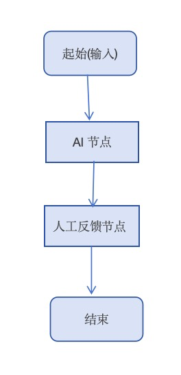

# Getting Started

### 访问描述
 首次时：
        1、http://localhost:8080/graph/human/chat1?query=我想吃苹果,查询食材库&thread_id=yan
         hread_id：用于记录线程，方便断流续流后续查询，线程id为用户id
 再次访问（后续多轮对话）：
        2、http://localhost:8080/graph/human/resume1?thread_id=yan&feed_back=
            feed_back: 用户反馈，如选择黄苹果，换成鸡腿，换成土豆丝，不加，今天，中餐等等
（
    1、http://localhost:8080/graph/human/chat?query=我想吃苹果,查询食材库&thread_id=yan
    2、http://localhost:8080/graph/human/resume?thread_id=yan&feed_back=
    返回多个节点信息
）

### 设计说明
   设计了两个节点：
            HumanNode节点：用于截断流程，系统获取人工反馈信息
            AiNode节点：用于识别意图，进行处理等。

            起始 (输入)：流程从开始节点开始。
            AI节点：开始节点连接到AI节点。
            人类反馈节点：AI节点处理后，流程进入人类反馈节点。
            再次进入AI节点：人类反馈节点处理后，再次进入AI节点。
            结束：最终，流程到达结束节点。
### 数据库 mysql
 建表：
 CREATE TABLE `foods` (
 `foodid` int NOT NULL AUTO_INCREMENT,
 `foodname` varchar(255) NOT NULL,
 `foodurl` varchar(255) NOT NULL,
 PRIMARY KEY (`foodid`)
 ) ENGINE=InnoDB AUTO_INCREMENT=7 DEFAULT CHARSET=utf8mb4 COLLATE=utf8mb4_0900_ai_ci;
 本地缓存：
        **google.guava**
### 功能描述
对话示例：
通过对话维护，两个数据结构 ，
1：每日餐食结构：{"mealkind":早餐,"mealdate":"2025-08-06",meals:['食物1'，'食物2']}
2：餐食库选择工具：[
{ 'foodName':'苹果','fooUid':"uid1" ,'picUrl':"https://127.0.0.1:8080"}
,{ 'foodName':'香蕉','fooUid':"uid2" ,'picUrl':"https://127.0.0.1:8080"},
{ 'foodName':'普通','fooUid':"uid3" ,'picUrl':"https://127.0.0.1:8080"}
]
user：我想吃苹果 , 调用食材库
ai： 食材库中发现有 { "existfoods": [红富士苹果，黄苹果，白苹果] }，请选择
user：选择黄苹果 和白苹果 b，每日餐饮信息搜集
ai：请补充那天吃
user：今天
ai：早餐，晚饭，午饭
user：早餐：
ai： {"mealkind":早餐,"mealdate":today,measl:['黄苹果'，白苹果]}
user：继续编辑，把白苹果，换成炒粉
ai：发现食材库中没有炒粉，是否把炒粉加入到食材库中
user：可以
ai： {"mealkind":早餐,"mealdate":today,measl:['黄苹果'，'炒粉']}
user：把炒粉换成鸡腿
ai：食材库中发现有 { "existfoods": ['麦当劳鸡腿'，‘kfc鸡腿’，‘烤鸡腿’] }，请选择
user：选择：麦当劳鸡腿
ai： {"mealkind":早餐,"mealdate":today,measl:['黄苹果'，麦当劳鸡腿]}
user：把黄苹果换成土豆丝
ai：发现食材库中没有土豆丝，是否加入到食材库中
user：不加了
ai：{"mealkind":早餐,"mealdate":today,measl:['黄苹果'，麦当劳鸡腿]}